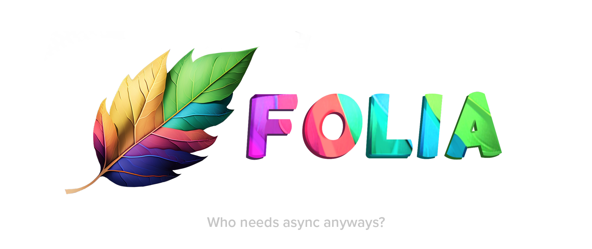

<div align=center>
    
    <br /><br />
    <p>Fork of a fork of <a href="https://github.com/PaperMC/Paper">Paper</a> which adds regionised multithreading and then removes it from the dedicated server.</p>
</div>

## Overview

Folia groups nearby loaded chunks to form an "independent region."
See [the PaperMC documentation](https://docs.papermc.io/folia/reference/region-logic) for exact details on how Folia
will group nearby chunks.
Each independent region has its own tick loop, which is ticked at the
regular Minecraft tickrate (20TPS). The tick loops are executed
on a thread pool in parallel. There is no main thread anymore, 
as each region effectively has its own "main thread" that executes
the entire tick loop.

For a server with many spread out players, Folia will create many
spread out regions and tick them all in parallel on a configurable sized
threadpool. Thus, Folia should scale well for servers like this.

Folia is also its own project, this will not be merged into Paper
for the foreseeable future. 

A more detailed but abstract overview: [Project overview](https://docs.papermc.io/folia/reference/overview).

## FAQ

### What server types can benefit from Folia-Unified?
Literally nobody will benefit from Folia-Unified. Learn how Folia works and then use it properly.

### What hardware will Folia-Unified run best on?
None of them. Use <a href="https://github.com/PaperMC/Folia">Folia</a>.

### How to best configure Folia-Unified?
By not using it.

### Maven information
* Maven Repo (for folia-api):
```xml
<repository>
    <id>papermc</id>
    <url>https://repo.papermc.io/repository/maven-public/</url>
</repository>
```
* Artifact Information:
```xml
<dependency>
    <groupId>dev.folia</groupId>
    <artifactId>folia-api</artifactId>
    <version>1.19.4-R0.1-SNAPSHOT</version>
    <scope>provided</scope>
</dependency>
 ```


## License
The PATCHES-LICENSE file describes the license for api & server patches,
found in `./patches` and its subdirectories except when noted otherwise.

The fork is based off of PaperMC's fork example found [here](https://github.com/PaperMC/paperweight-examples).
As such, it contains modifications to it in this project, please see the repository for license information
of modified files.
